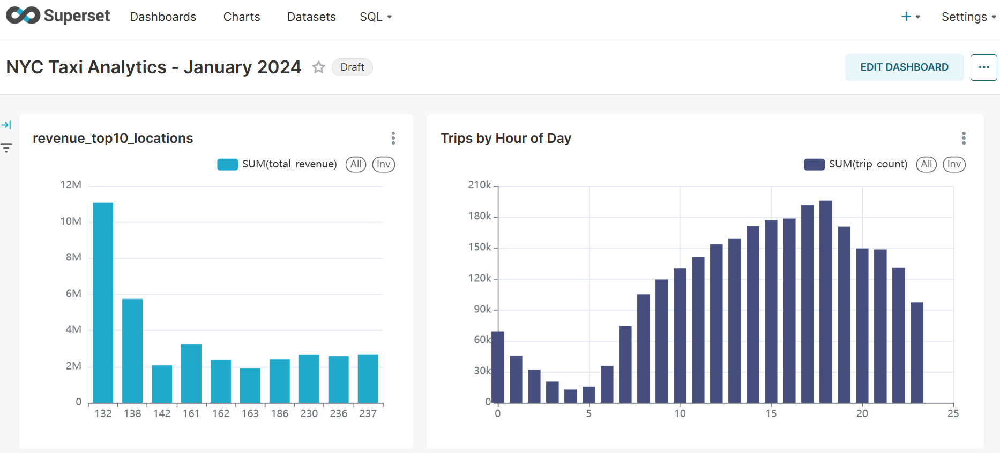

# NYC Taxi ETL Pipeline

Production-grade batch ETL pipeline processing **2.7M+ NYC Yellow Taxi records** 
built on a fully containerized big data stack. Implements medallion architecture 
with automated data quality enforcement, SQL query layer, and BI dashboards.

## Dashboard



## Overview

This pipeline ingests raw NYC TLC trip data, applies multi-layer validation and 
transformation, exposes clean data via a SQL engine, and surfaces business insights 
through interactive dashboards — all orchestrated automatically on a daily schedule.

**Key results from January 2024 data:**
- Processed **2,964,624** raw records in under 3 minutes
- Enforced **5 data quality rules**, filtering **8.1%** invalid records
- Identified JFK Airport (Zone 132) as top revenue zone at **$11M/month**
- Peak demand at **18:00** with **195,911 trips** — 15x higher than 04:00 low

## Architecture
```
┌─────────────────────────────────────────────────────────────┐
│                      Airflow DAG                            │
│  quality_check → extract → transform → load → register      │
└─────────────────────────────────────────────────────────────┘
│              │            │           │
▼              ▼            ▼           ▼
[Validation]    [HDFS /raw]  [HDFS /processed] [Trino]
5 DQ checks     50MB Parquet  Partitioned       SQL layer
year/month
│
▼
[Superset]
Dashboards
```
**Data flow:**
1. Raw Parquet files land in HDFS `/data/raw`
2. Quality checks validate schema, row counts, null rates, date ranges
3. Spark transforms clean and enrich data, partition by year/month
4. Aggregations computed — revenue by zone, demand by hour
5. Trino registers table metadata via Hive Metastore
6. Superset queries Trino directly — no data duplication
7. Telegram alert fires on any task failure

## Stack

| Component | Version | Role |
|-----------|---------|------|
| Apache Spark | 3.5.3 | Distributed processing engine |
| HDFS (Hadoop) | 3.2.1 | Distributed file storage |
| Apache Airflow | 2.8.1 | Workflow orchestration |
| Trino | 426 | Federated SQL query engine |
| Hive Metastore | 3.1.3 | Table and partition metadata |
| Apache Superset | 3.1.0 | BI and data visualization |
| PostgreSQL | 15 | Airflow and Metastore backend |
| Docker Compose | — | Full cluster containerization |
| Python | 3.8 | PySpark job implementation |

## Data Quality Framework

Pipeline enforces strict quality gates before processing begins.
Any failed check raises `DataQualityError` and halts execution immediately.

| Validation | Rule | Severity |
|------------|------|----------|
| File not empty | `row_count > 0` | CRITICAL |
| Minimum volume | `row_count >= 1,000,000` | CRITICAL |
| Schema integrity | All required columns present | CRITICAL |
| Null rate | `fare_amount` nulls < 10% | CRITICAL |
| Date validity | Records before 2022 < 1% | CRITICAL |

## Quick Start

**Prerequisites:** Docker Desktop, Docker Compose, WSL2 (Windows), GNU Make
```bash
git clone https://github.com/ustaznet-dotcom/etl-hdfs-spark.git
cd etl-hdfs-spark
cp .env.example .env
make up
make init-hdfs
make load-data
make run
```

The full pipeline completes in approximately 3-5 minutes depending on hardware.

## Service Endpoints

| Service | URL | Credentials |
|---------|-----|-------------|
| Airflow | http://localhost:8080 | admin / admin |
| Spark Master | http://localhost:8081 | — |
| HDFS NameNode | http://localhost:9870 | — |
| Superset | http://localhost:8088 | admin / admin |
| Trino | http://localhost:8089 | — |

## Project Structure
```
├── dags/
│   ├── nyc_taxi_etl.py        # Main DAG definition
│   └── alerts.py              # Telegram failure notifications
├── jobs/
│   ├── extract/
│   │   ├── extract.py         # HDFS ingestion
│   │   └── quality_check.py   # Pre-processing validation
│   ├── transform/
│   │   └── transform.py       # Cleaning, enrichment, partitioning
│   └── load/
│       ├── load.py            # Aggregation layer
│       └── register_table.py  # Trino table registration
├── docker/
│   ├── hadoop/                # HDFS core-site, hdfs-site configs
│   └── trino/                 # Trino coordinator and catalog configs
├── docs/
│   └── dashboard.png
├── docker-compose.yml         # 10-service cluster
├── Makefile                   # Operational shortcuts
└── .env.example               # Required environment variables
```
## Pipeline Metrics (January 2024)
```
Input:            2,964,624 records
Valid records:    2,723,707 records  (91.9%)
Filtered:           240,917 records  (8.1%)
Processing time:        ~3 minutes
Revenue leaders:
Zone 132  JFK Airport      $11,077,565
Zone 138  LaGuardia         $5,746,299
Zone 161  Midtown East      $3,234,940
Hourly demand:
Peak    18:00   195,911 trips  avg fare $16.95
Off-peak 04:00   12,782 trips  avg fare $23.02
```
## Design Decisions

**Why HDFS over object storage?**
Demonstrates distributed file system fundamentals and data locality 
principles relevant to on-premise and hybrid cloud deployments.

**Why Trino over loading into PostgreSQL?**
Federated query execution eliminates data duplication. Analysts query 
Parquet files directly — no ETL into a separate analytical database.

**Why partitioning by year/month?**
Partition pruning reduces scan cost for time-range queries from full 
table scans to single-partition reads — critical at scale.

**Why separate quality_check task?**
Isolates validation from ingestion. Failed checks appear as a distinct 
task in Airflow, making root cause identification immediate.

## Author

**Umar Kartoev** — Data Engineer

Specializing in batch and streaming data pipelines, big data infrastructure, 
and analytical platform development.

- GitHub: [ustaznet-dotcom](https://github.com/ustaznet-dotcom)
- LinkedIn: [umar-kartoev](https://linkedin.com/in/umar-kartoev-692892365)
- Telegram: [@umarkv](https://t.me/umarkv)
